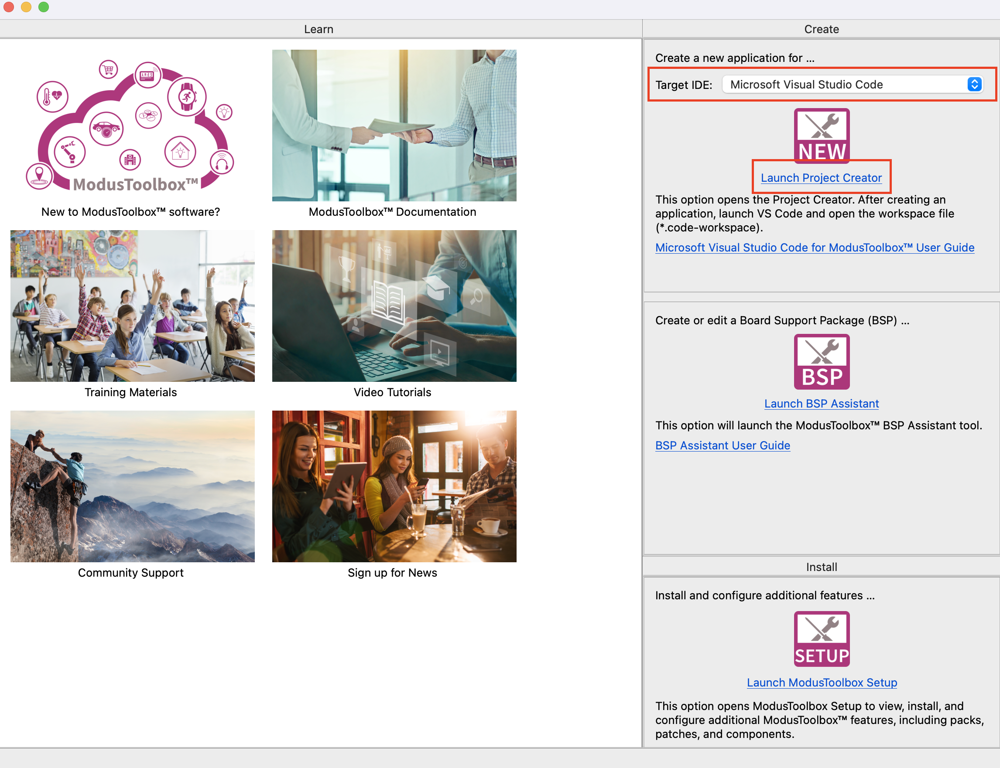
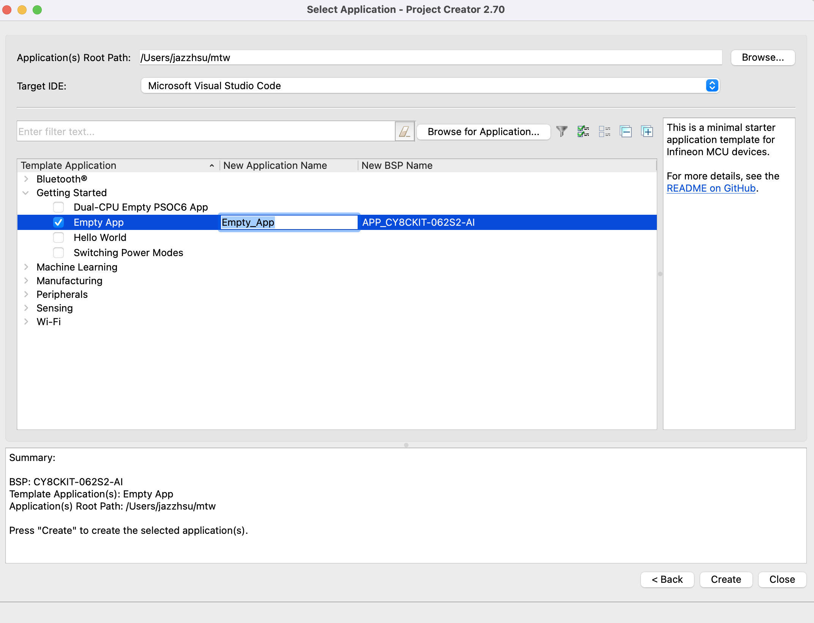
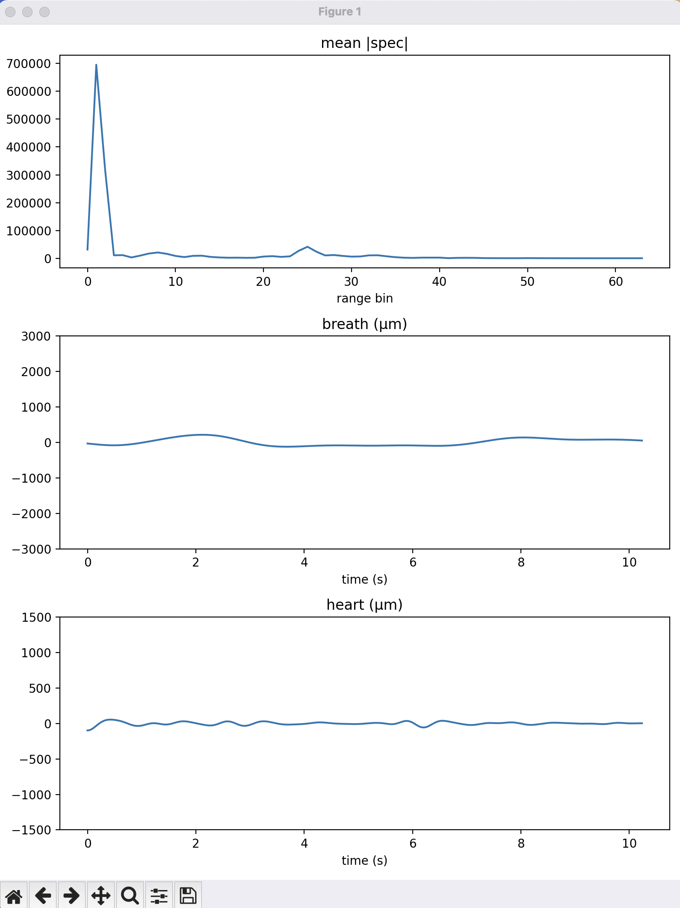
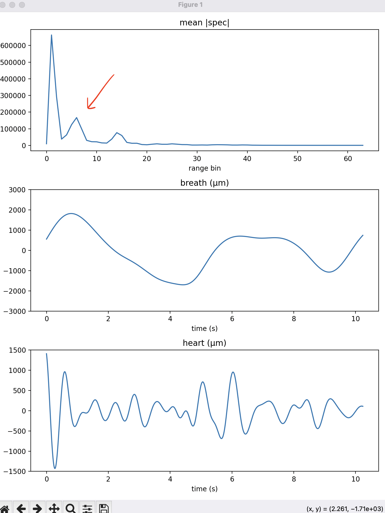

# Vital Sense (EmbIoT)

## Introduction

This is a vital sense application for [PSoC 6 AI Evaluation Kit](https://www.infineon.com/evaluation-board/CY8CKIT-062S2-AI)

The application have two parts:
- main.c: Read onboard radar data and stream raw data to the host machine.
- host/*: Run on host machine that accepts the raw data and visualize the analysis.

## Requirements

- [ModusToolbox&trade;](https://www.infineon.com/modustoolbox) v3.7 or later (tested with v3.7)
- Python3 (tested with Python 3.14.4)

## Setup

1. Open the dashboard app
2. At the top-right corner, select visual studio code as IDE
3. Click "Launch Project Creator"


4. If the board is connected to the PC, you should see "\*\*Detected devices\*\*". Select that. Otherwise, select PSOC 6 BSPs, then CY8CKIT-062S2-AI. Click "Next".


5. Select "Getting Started", then "Empty App". Change the application name or keep it as is. Change path at the top if needed. Then, click "Create"


6. Clone this repo in a temporary folder
```
git clone git@github.com:Jazzhsu/EmbIoT_VitalSense.git
```

7. Copy everything in repo into the empty app folder you just created in step 5

8. Open VSCode. File -> Open. Go to the empty app folder, select `mtb-example-empty-app.code-workspace`

9. Click "Open Workspace" at the bottom right of the file.


10. Terminal -> Run Task..., Select "Tool: Library Manager". Continue without scanning.

11. Verify: you should see "sensor-xensiv-bgt60trxx" as the last item in the library list. Click "Update"

12. Terminal -> Run Task..., Select "Build". Wait for the build.

13. Terminal -> Run Task..., Select "Program". Wait for the board programming to be complete.

14. Verify: you can go to the VSCode NRFConnect extension. You should see device "3150C5A012D2400". Connect to the VCOM0 of that device. You should see (You may need to reset or reprogram the device to see the output):
```
****************** Vital Sense Application ****************** 

0:000 USBD_Start
BGT60TRXX setup complete
```

15. Open a terminal, goto the project folder and cd into `host/`
```
cd host
```

16. Install required python packages
```
pip3 install -r requirements
```

17. Find the usb port name:

MacOS
```
ls /dev/tty.usbmodem2439*
```

Windows
```
TODO
```

In my case the name is `/dev/tty.usbmodem24391`

18. Start host application (replace the usb port name if necessary):
```
python3 host.py -s /dev/tty.usbmodem24391
```

19. You should now see a plot popped up. (You will need to wait a few seconds for the graph to be propagated.
 


20. Face the board towards your chest (keep ~50cm distance from your chest) and keep it steady. Or place it on the table so that the board is facing your chest.

In graph 1 you should see a peak except the first 5 bins like this. That peak is you.
Graph 2 & 3 is your chest displacement for breath and heartbeat respectively.


